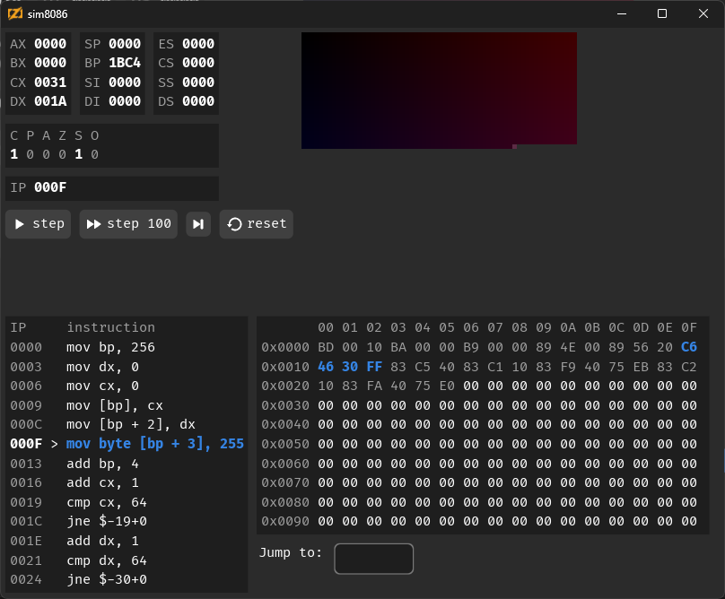

# sim8086
Decode and simulate x8086 instructions with in a debug UI. Supports a very [limited set of instructions](https://github.com/araex/sim8086/blob/main/src/x86/decode.zig#L378-L423). See `src/data` for example input.

Homework for https://computerenhance.com programming series.

## Memory
- Program is loaded starting at `0x0`.
- 64x64xRGBA framebuffer from `0x0100` to `0x4100`.
- Memory segmentation is not supported, it can only address 16 bit.

## Prerequisites
- zig, tested with 0.15.0-dev.77+aa8aa6625

To run the tests:
- [`nasm`](https://en.wikipedia.org/wiki/Netwide_Assembler) in PATH
- Write permissions in hardcoded directory [`out_dir`](https://github.com/araex/sim8086/blob/main/src/nasm.zig#L5)

## Usage
`zig build sim8086 -- src/data/listing_0055_challenge_rectangle` build and runs the simulator

`zig build test` builds and runs the tests.
